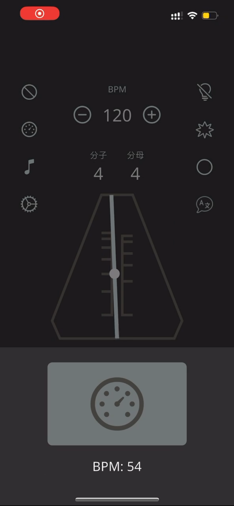

  
# soulnd - metronome

A iOS style metronome app with many functions built with flutter. We made this app because we want to build an app which is easy to use and has full function that musicians need.

These are our aims
- iOS style appearance
- less text while more photos
- all functions that are musicians' need

  

